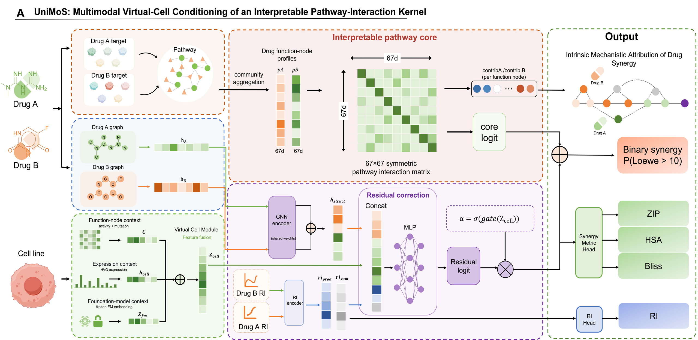

# UniMoS

**Interpretable drug-combination synergy prediction, conditioned on a virtual cell.**

A dual-track model: a cell-conditioned pathway kernel that you can read, plus a residual track that catches what the kernel cannot see.

[](https://www.python.org/)
[](https://pytorch.org/)
[](https://lightning.ai/)

[English](README.md) · [简体中文](README.zh-CN.md)

---

UniMoS predicts whether two drugs are synergistic in a given cell line (Loewe > 10). The kernel track scores cross-pathway interactions in a 67-node function space; the virtual-cell module folds a frozen scFoundation embedding, functional activity, and residual expression into one context vector `z_cell` that conditions both tracks.

> [!NOTE]
> This repository releases **model code, training/eval entry points, and official hyperparameters**. Preprocessed DrugComb features and checkpoints are not bundled.

<p align="center">
  
</p>

## Architecture

The kernel is the scientific claim. The residual track is a gated backup for cold-start drugs with missing targets. `z_cell` conditions both, so unseen cell lines are not scored with a static pathway matrix.

| Piece | What it actually does |
| --- | --- |
| **Virtual cell** | Looks up a frozen scFoundation embedding, fuses it with 67-d functional activity and an HVG expression encoder, and emits `z_cell`. |
| **Pathway kernel** | Builds a symmetric bilinear matrix `W(z_cell)` over function nodes. `pAᵀ W pB` is the cross-pathway synergy score; `γ` captures same-node synergy vs redundancy. |
| **Residual track** | Encodes Morgan fingerprints (or a GIN graph) and single-drug RI. Used when the kernel has no target annotation to work with. |
| **Gate** | `α(z_cell)` scales the residual. The kernel remains the default explanation; the residual is not allowed to silently dominate. |
| **Heads** | Primary task: synergy classification. Auxiliary: single-drug RI regression (optional ZIP/HSA/Bliss regression in the official configs). |

## Key features

- **Mechanism-shaped kernel, not a post-hoc explainer.** Synergy is scored in function-node space. `W_sym` and per-drug contributions are model outputs, not SHAP after the fact.
- **Virtual-cell conditioning.** Unseen cell lines get a pretrained expression embedding instead of a one-hot or a 67-d activity vector alone.
- **Cold-start splits as the protocol.** Official configs cover leave-drug-out, leave-cell-out, leave-pair-out, and random split — LDO/LCO are the ones that matter.
- **Gated residual, not a second black box.** Structure and RI can rescue unannotated drugs; `α(z_cell)` is regularised so the kernel stays accountable.
- **Official configs, not a hyperparameter dump.** `configs/` has one YAML per split: `lco`, `ldo`, `lpo`, `random`.

## Quick start

> [!TIP]
> Place preprocessed features under `train_data/` first. Without that directory the training entry will not run.

```bash
conda create -n unimos python=3.10
conda activate unimos
pip install -r requirements.txt

# smoke test (2 epochs, one split)
python train.py --split ldo --seed 0 --fast-dev-run
```

Train with the official configs:

```bash
python train.py --split lco --seed 34 --config configs/lco.yaml
python train.py --split ldo --seed 34 --config configs/ldo.yaml
python train.py --split lpo --seed 34 --config configs/lpo.yaml
python train.py --split random --seed 34 --config configs/random.yaml
```

Evaluate a checkpoint, then pool seeds:

```bash
python evaluate.py run --checkpoint checkpoints/lco/seed_34/best.ckpt --split lco --seed 34
python summarize.py --outputs-dir checkpoints/ --results-dir results/
```

Optional: Optuna search (`tune.py`) and novel-pair scoring (`scripts/predict_novel_pair.py`). The GIN encoder additionally needs `torch-geometric` installed for your PyTorch/CUDA pair.

## Evaluation splits

| Split | Held out | Difficulty |
| --- | --- | --- |
| `ldo` | drugs unseen in training | hardest |
| `lco` | cell lines unseen in training | hard |
| `lpo` | drug pairs unseen; single drugs seen | medium |
| `random` | random rows | easy; sanity check only |

## Repository layout

```text
unimos/
  model/         UniMoS LightningModule, virtual cell, pathway kernel, encoders
  training/      multi-task loss and metrics
  data/          dataset, splits, scFoundation embedding precompute
  eval/          baselines, calibration, interpretability export
train.py         single run
tune.py          Optuna HPO
evaluate.py      test metrics + kernel export
configs/         official YAML per split (lco, ldo, lpo, random)
docs/assets/     architecture figure
```

## License

No license file is attached yet. Read and reproduce; for any other use, contact the authors.
