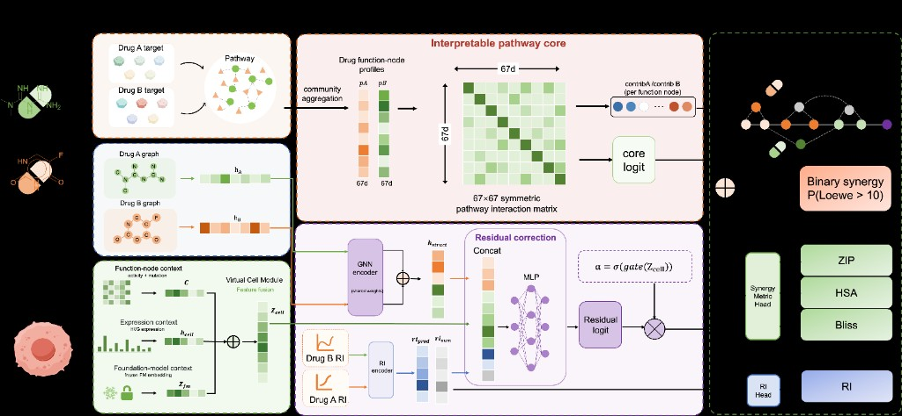

# UniMoS

**用虚拟细胞条件化的、可解释的药物组合协同预测。**

双轨模型：一条能读的细胞条件化通路核，一条兜底残差轨，用来补核看不到的信息。

[](https://www.python.org/)
[](https://pytorch.org/)
[](https://lightning.ai/)

[English](README.md) · [简体中文](README.zh-CN.md)

---

UniMoS 预测两种药在给定细胞系里是否协同（Loewe > 10）。核轨道在 67 维功能节点空间里打分跨通路交互；虚拟细胞模块把冻结的 scFoundation embedding、功能活性和表达残差合成一个上下文向量 `z_cell`，同时条件化两条轨道。

> [!NOTE]
> 本仓库只发布**模型代码、训练/评估入口和正式超参**。预处理 DrugComb 特征和检查点不随仓库分发。

<p align="center">
  
</p>

## 架构

核轨道才是科学主张。残差轨道是门控备份，给缺靶点标注的冷启动药物用。`z_cell` 同时条件化两者，所以未见细胞系不会拿一张静态通路矩阵去打分。

| 模块 | 实际在做什么 |
| --- | --- |
| **虚拟细胞** | 查表冻结的 scFoundation embedding，与 67 维功能活性和 HVG 表达编码器融合，得到 `z_cell`。 |
| **通路核** | 在功能节点上构造对称双线性矩阵 `W(z_cell)`。`pAᵀ W pB` 是跨通路协同分；`γ` 刻画同节点协同 vs 冗余。 |
| **残差轨道** | 编码 Morgan 指纹（或 GIN 分子图）和单药 RI。核没有靶点可用时走这里。 |
| **门控** | `α(z_cell)` 缩放残差。默认解释仍来自核，残差不能默默主导。 |
| **输出头** | 主任务：协同二分类。辅助：单药 RI 回归（正式配置还可选 ZIP/HSA/Bliss 回归）。 |

## 要点

- **核本身就是机制，不是事后解释器。** 协同在功能节点空间里打分。`W_sym` 和逐药贡献是模型输出，不是事后 SHAP。
- **虚拟细胞条件化。** 未见细胞系用预训练表达 embedding，而不是 one-hot 或单独的 67 维活性。
- **冷启动拆分才是协议。** 正式配置覆盖 leave-drug-out、leave-cell-out、leave-pair-out 和随机拆分——真正要紧的是 LDO/LCO。
- **门控残差，不是第二个黑盒。** 结构和 RI 能兜底无标注药物；`α(z_cell)` 有正则，核仍然可问责。
- **正式配置，不是超参堆场。** `configs_final/` 只有四场景生产设置和对应结构消融（`wo_vc`、`wo_gnn`、`wo_kernel`、`wo_residual`）。

## 快速开始

> [!TIP]
> 先把预处理特征放到 `train_data/`。文件清单见 [docs/data.md](docs/data.md)。没有这个目录，训练入口跑不起来。

```bash
conda create -n unimos python=3.10
conda activate unimos
pip install -r requirements.txt

# 冒烟测试（2 个 epoch，一个 split）
python train.py --split ldo --seed 0 --fast-dev-run
```

用正式超参训练：

```bash
python train.py --split lco --seed 34 --config configs_final/lco.yaml
python train.py --split ldo --seed 34 --config configs_final/ldo.yaml
python train.py --split lpo --seed 34 --config configs_final/lpo.yaml
python train.py --split random --seed 34 --config configs_final/random.yaml
```

评估检查点，再按 seed 汇总：

```bash
python evaluate.py run --checkpoint checkpoints/lco/seed_34/best.ckpt --split lco --seed 34
python summarize.py --outputs-dir checkpoints/ --results-dir results/
```

可选：Optuna 搜索（`tune.py`）和新药对打分（`scripts/predict_novel_pair.py`）。GIN 编码器还需按本机 PyTorch/CUDA 安装 `torch-geometric`。

## 评估拆分

| 拆分 | 留出内容 | 难度 |
| --- | --- | --- |
| `ldo` | 训练未见的药物 | 最难 |
| `lco` | 训练未见的细胞系 | 难 |
| `lpo` | 未见药物对；单药可见 | 中 |
| `random` | 随机行 | 易；只作 sanity check |

## 仓库结构

```text
unimos/
  model/         Lightning 主模型、虚拟细胞、通路核、编码器
  training/      多任务损失与指标
  data/          Dataset、划分、scFoundation embedding 预计算
  eval/          基线、校准、可解释性导出
train.py         单次训练
tune.py          Optuna HPO
evaluate.py      测试指标 + 核导出
configs_final/   正式 split 配置与结构消融
docs/            数据布局和其他说明
```

## 文档

- [数据布局](docs/data.md)：训练器需要的 `train_data/` 文件，以及如何预计算虚拟细胞 embedding

## 许可

仓库尚未附带 LICENSE。阅读和复现可以；其他用途请先联系作者。
